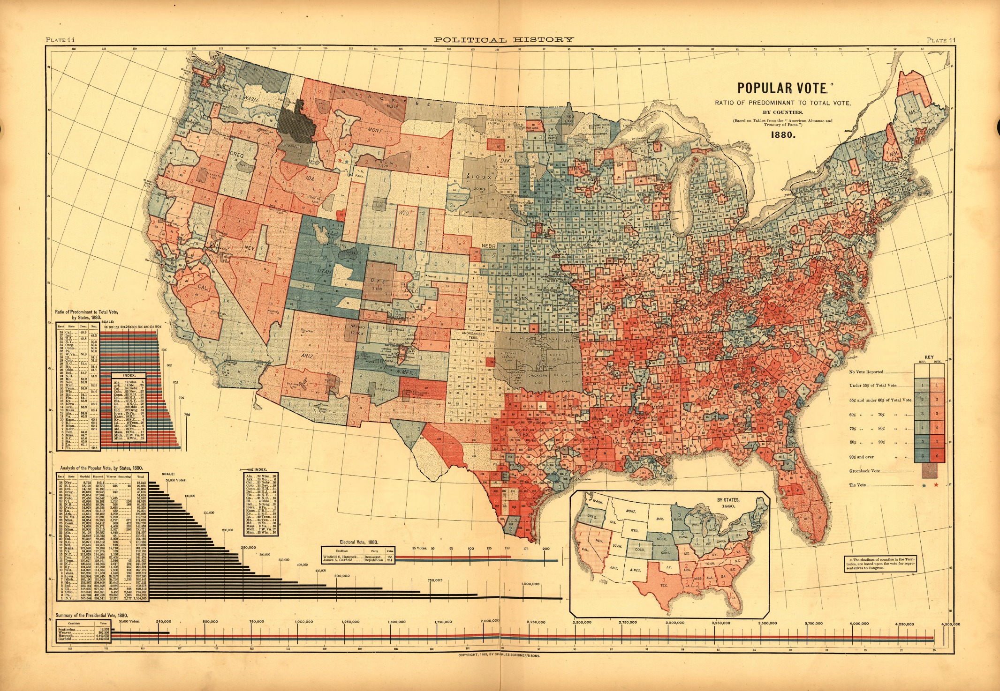
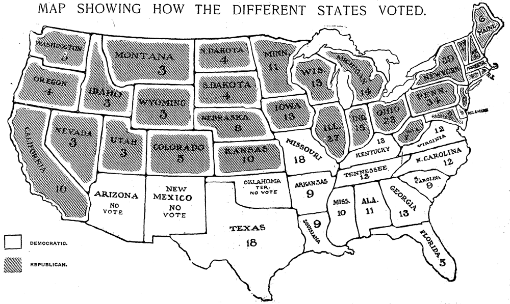
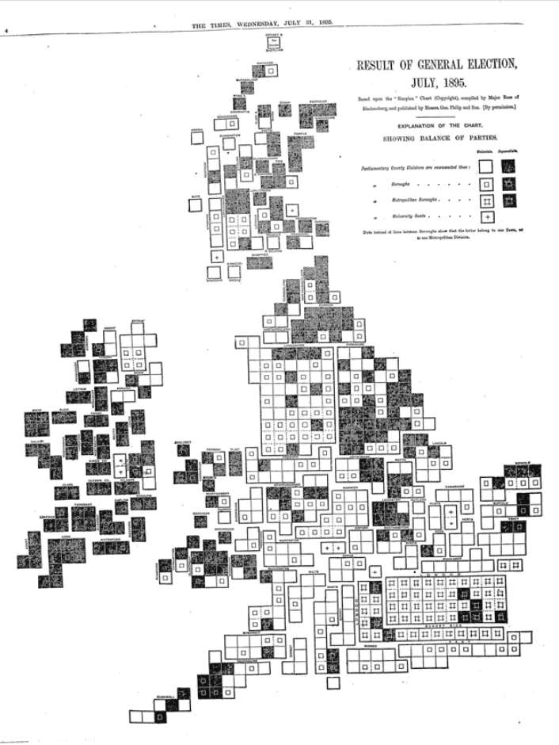

# Wprowadzenie {#wprowadzenie}

Wybory są jednym z podstawowych narzędzi współczesnych demokracji. 
Demokracja pośrednia, znana również jako przedstawicielska, jest dominującą formą demokracji na świecie, funkcjonuje ona również w Polsce.
Encyklopedia PWN (2020) definiuje wybory jako \textit{„sposób powoływania obywateli do pełnienia funkcji publicznych w organach państwowych, a także w organach samorządowych, partii politycznych i in. organizacji społecznych, przez głosowanie na wysuniętych kandydatów lub ich listy.”}

Historia map wyborczych sięga ponad 200 lat, kiedy w 1869 roku odbyły się wybory parlamentarne w Paryżu. 
Mapa pokazuje obrazuje zmieniający się nastrój polityczny w stolicy, który doprowadził do zamieszek wewnętrznych, a ostatecznie do wielkiej wojny międzynarodowej i upadku Drugiego Cesarstwa Francuskiego [@cartographia2008]. 
Najstarsza znana mapa wyborów prezydenckich pochodzi jednak z Atlasu Statystycznego Stanów Zjednoczonych opublikowanego w 1883 roku i przedstawia wyniki na poziomie stanów i hrabstw z wyborów prezydenckich w 1880 roku [@schulten2013]. 
Mapa nie tylko pokazuje, która partia wygrała w każdym z hrabstw, ale także ukazuje przewagę partii za pomocą cieniowania gradientowego (Ryc.\@ref(fig:ryc11)).

```{r ryc11, echo=FALSE, fig.cap="Mapa wyborów prezydenckich w Stanach Zjednoczonych w 1880 roku. Źródło: http://www.mappingthenation.com/blog/the-nations-first-electoral-map/", out.width=400}

```

Postęp w technikach kartograficznych nabrał tempa wraz z rozwojem drukarstwa oraz możliwością tworzenia niestandardowych grafik do gazet [@kongres2013]. 
Pozwoliło to na spopularyzowanie mapy jako formy reprezentacji danych wyborczych oraz w konsekwencji, rozwój technik tworzenia map (Ryc.\@ref(fig:ryc12)-(\@ref(fig:ryc13)).

Pomimo swojej długiej historii, mapy wyborcze stały się popularne dopiero w ciągu ostatnich 30 lat. 
W połączeniu z rozwojem technologii mapy stały się jednymi z najbardziej efektywnych sposobów uwieczniania informacji o charakterze przestrzennym, w tym danych wyborczych. 
Pozwalają one nam szybko i łatwo przeanalizować informacje.
Główną zaletą wizualizacji przestrzennych jest możliwość odnoszenia ich do wybranych lokalizacji lub jednostek administracyjnych. 
Możliwość iteracji pozwala na tworzeniu wielu wizualizacji za pomocą tych samych danych.

```{r ryc12, echo=FALSE, fig.cap="Mapa wyborów prezydenckich w Stanach Zjednoczonych w 1896 roku. Źródło: https://mode.com/blog/presenting-data-election-maps", out.width=300}

```

```{r ryc13, echo=FALSE, fig.cap="Mapa wyborów parlamentarnych w Wielkiej Brytanii w 1895 roku. Źródło: http://www.ericson.net/content/2010/11/first-nyt-election-map/", out.width=200}

```

Jedną z rozwijających się kierunków badań w zakresie kartografii jest wizualizacja. 
Gałąź ta powstała w latach 90. XX wieku wskutek rozwoju oraz upowszechnienia się technologii komputerowych. 
W porównaniu do kartografii, wizualizacja jest elementem procesu poznawczej analizy danych przestrzennych, a jej celem jest odkrywanie prawidłowości i informacji w danych o charakterze przestrzennym. [@maceachren1994].

W Polsce wybory są regulowane przez ustawę z dnia 5 stycznia 2011 r. - [Kodeks wyborczy](https://pkw.gov.pl/uploaded_files/1598525869_kodeks-wyborczy-2020-lipiec.pdf). 
Ustawa ta weszła w życie 1 sierpnia 2011 roku i zawiera przepisy dotyczące m.in. przeprowadzania wyborów prezydenckich. 
Znajdują się w niej również przepisy o warunkach ważności wyborów i przepisy karne za wykroczenia i niektóre przestępstwa popełnione przeciwko wyborom. 
Za organizację i przebieg wyborów odpowiada w Polsce Państwowa Komisja Wyborcza (PKW) z Krajowym Biurem Wyborczym (KBW), które jest jej organem wykonawczym.
Zadaniem Państwowej Komisji Wyborczej jest również gromadzenie oraz udostępnianie informacji wyborczych, w tym wyników wyborów z poziomu obwodów wyborczych oraz jednostek administracyjnych. 

Powszechne, w pełni demokratyczne wybory prezydenckie III Rzeczypospolitej odbyły się po raz pierwszy 25 listopada 1990 roku. 
Wybory prezydenckie odbywają się na zarządzenie Marszałka Sejmu, a kadencja trwa 5 lat. 
Ostatnie wybory na prezydenta RP zostały przeprowadzone 28 czerwca 2020 roku [@marszalek2020].

W przypadku Polski historyczne mapy wyborcze znajdują się m.in. w Atlasie Rzeczypospolitej Polskiej, gdzie przedstawione są wybory prezydenckie z 1990 (Ryc.\@ref(fig:ryc14)) i 1995 roku (Ryc.\@ref(fig:ryc15)). W obu przypadkach przedstawione są wyłącznie kartogramy skokowe, pola odniesienia ograniczono do województw oraz gmin. 

```{r ryc14, echo=FALSE, fig.cap="Mapa wyborów prezydenckich w Polsce w 1990 roku. Źródło: Atlas Rzeczypospolitej Polskiej", out.width=300}
knitr::include_graphics("figures/ryc14.png")
```

```{r ryc15, echo=FALSE, fig.cap="Mapa wyborów prezydenckich w Polsce w 1995 roku. Źródło: Atlas Rzeczypospolitej Polskiej", out.width=300}
knitr::include_graphics("figures/ryc15.png")
```

Jak wspomniano wyżej, wizualizacja map wyborczych w Polsce ogranicza się w znacznej części do kartogramów skokowych. 
Istnieją inne formy wizualizacji, które przykładają mniejszą wagę do powierzchni i pozwalają na dokładniejsze przedstawienie wartości. 
Są to, m.in., kartogramy geometryczne oraz anamorfozy (kartogramy odwrócone).  
Niska popularność tych form jest związana z przyzwyczajeniem społeczeństwa do analizowania map opartych o jednostki administracyjne jak powiaty lub województwa. 
Trudność potrafią sprawić również zniekształcenia związane z anamorfozą, w skrajnych przypadkach powierzchnia jednostki odniesienia może być nie do rozpoznania. 
Do prawidłowej interpretacji powyżej wspomnianych dwóch rodzajów map niezbędna jest również wiedza o rozmiarach i rozmieszczeniu jednostek.

Celem pracy jest porównanie różnych technik wizualizacji na przykładzie wyborów prezydenckich w 2020 roku w Polsce. 
Nastąpiło to poprzez przygotowanie map używając metod kartogramu właściwego, kartogramu ciągłego, kartogramu geometrycznego, anamorfozy ciągłej, nieciągłej i kartodiagramu Dorlinga oraz oceniono pod względem stopnia ich czytelności. 
Podjęto również próbę porównania właściwości rozpatrywanych technik oraz określenia zakresu ich zastosowania; szukano odpowiedzi na pytanie o to, jaką i na ile dokładną informację można uzyskać na podstawie każdej z technik. 
W tym celu zostały zebrane oraz opracowane dane z Państwowej Komisji Wyborczej, które następnie posłużyły do stworzenia wizualizacji - do tego użyto dwa pakiety z języka R: cartogram [@r-cartogram] oraz geogrid [@r-geogrid]. 
Opracowane zostały dwie wersje ankiety mające na celu ocenę stopnia trudności interpretacji wizualizacji. 
Ankiety została przeprowadzone z udziałem studentów trzeciego oraz czwartego roku studiów na Wydziale Nauk Geograficznych i Geologicznych UAM, a w oparciu o jej wyniki przeprowadzono analizę czytelności każdej z technik wizualizacji.
