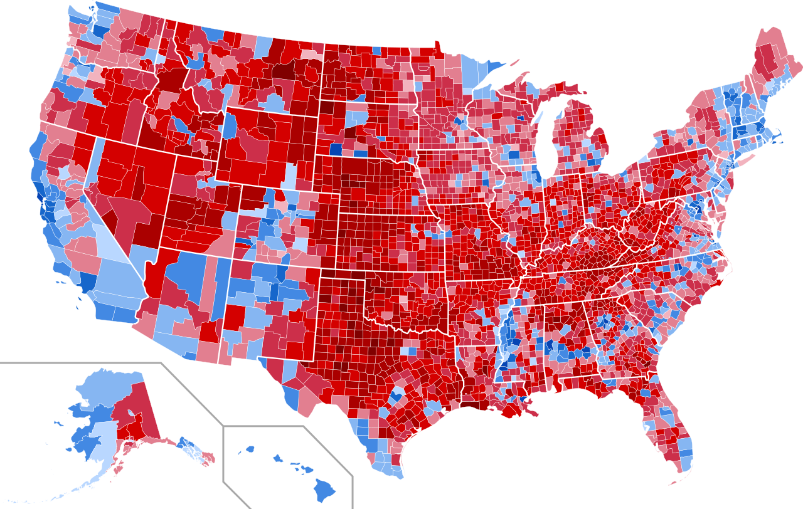
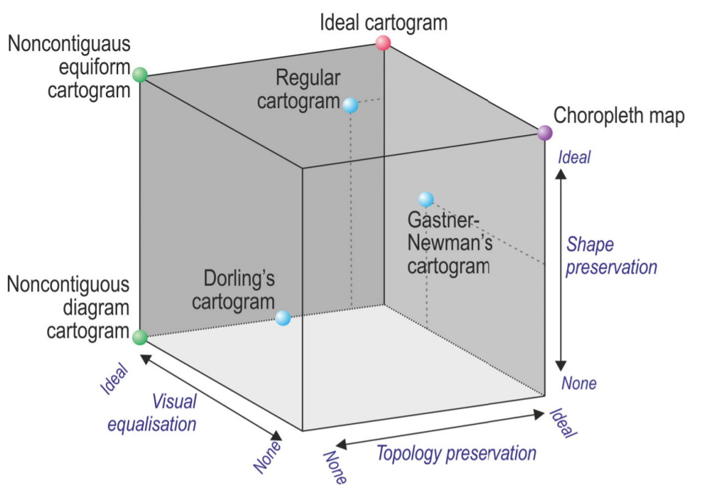
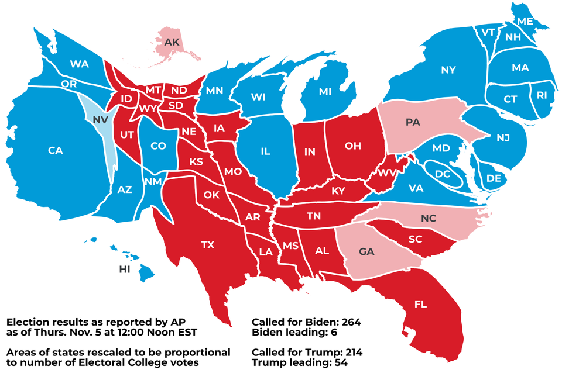

# Przegląd literatury {#lit}

## Kartogramy właściwe oraz ciągłe {#kartogramy1}

Popularną metodą stosowaną do przedstawiania i analizowania zależności zjawisk jest kartogram. 
Jego popularność można zawdzięczyć prostocie oraz łatwości wykonania. Jest to ilościowa metoda średniej intensywności, tzn. ukazuje natężenie, gęstość czy odchylenia od średniej danego zjawiska. 
Odniesieniem dla zjawisk jest powierzchnia pola podstawowego/jednostki przestrzennej, którą wykorzystujemy [@ratajski1989]. 
Najczęściej są to granice administracyjne lub inne, wcześniej przyjęte granice. 
Zmiany w intensywności barw lub szrafów są ściśle związane z natężeniem wartości, tj. odbiorca odbiera pole/jednostkę przestrzenną z intensywniejszym lub ciemniejszym odcieniem jako tą z wyższą wartością.

Wartości badanego zjawiska można wyrazić za pomocą przedziałów klasowych lub w sposób ciągły. 
Ten drugi jest znacznie rzadziej wykorzystywany [@ratajski1989]. 
Tworzenie przedziałów klasowych polega na grupowaniu wartości w grupy. 
Dobór zależy w dużej mierze od charakterystyki rozkładu danych, jednak najczęściej spotykane są:

* przedziały interwałowe (normatywne), których rozpiętość jest uzależniona od zjawiska i jego charakteru funkcjonalnego,

* przedziały o jednakowej rozpiętości. Mogą one powstać np. poprzez podzielenie ekstremalnych wartości zbiorowości przez liczbę planowanych przedziałów;

* przedziały analityczne, które wyznaczane są poprzez analizę danych, np. wyznaczanie przedziałów według postępu arytmetycznego lub geometrycznego.

Chociaż kartogram jest powszechnie używany, jest on często nieadekwatny i prowadzi do mylnej interpretacji [@leonowicz2006]. 
Dobrym przykładem jest kartogram przedstawiający udział głosów w wyborach prezydenckich w Stanach Zjednoczonych w 2016 roku, przedstawiony na Ryc. \@ref(fig:ryc21). 
Użyta została rozbieżna paleta kolorów, gdzie czerwony kolor oznacza przewagę głosów oddanych na kandydata Partii Republikańskiej, a kolor niebieski – Partii Demokratycznej. 
Im ciemniejszy kolor, tym większy udział partii na danym obszarze.

(ref:linkwiki) https://commons.wikimedia.org/wiki/File:United_States_presidential_election_results_by_county,_2020.svg

```{r ryc21, echo=FALSE, fig.cap="Mapa wyborów prezydenckich w Stanach Zjednoczonych w 2020 roku. Źródło: (ref:linkwiki)", out.width=400}

```

Na pierwszy rzut oka można wywnioskować, że Partia Republikańska dominuje w znacznym stopniu na mapie nad Partią Demokratyczną.
Można nawet przypuścić, że kandydat Partii Republikańskiej zdecydowanie wygrał pod względem głosów na niego oddanych. 
Nie jest to jednak prawda, bowiem kolory i ich rozkład przestrzenny nie uwzględnia w tym przypadku powierzchni i częściowo zmylają odbiorcę jakoby rozmieszczenie ludności było równe. 

Obszar, który ma 100 wyborców, z których 90 głosowało na Republikanów, jest pokazany jako ciemnoczerwony z 90% udziałem. 
Dokładnie ten sam kolor jest użyty dla obszaru, który ma 10 000 wyborców, z których 9 000 głosowało na Republikanów. 
Takie wykorzystanie kartogramu zniekształca nasze postrzeganie wyniku wyborów, wpływając na naszą percepcję sugerując, że dominacja czerwieni oznacza więcej głosów i przewagę Partii Republikańskiej. 
Gdyby jednak uwzględnić gęstość zaludnienia, okazałoby się, że znaczna część kraju, w tym obszary pokryte kolorem czerwonym, są słabo zaludnione. 

## Kartogramy geometryczne

W kartogramach geometrycznych jednostki przestrzenne zostają zastąpione polami o jednakowym kształcie i wielkości. 
Najczęściej do tego używane są sześcioboki (heksagony) oraz prostokąty, których przykład jest widoczny na Ryc. \@ref(fig:ryc22), w mniejszym stopniu trójkąty. 
Kartogramy geometryczne są wyjątkowo przydatne przy porównaniach pomiędzy latami, kiedy istnieje szansa, że granice jednostek się zmieniły [@ratajski1989]. 
Kartogramy geometryczne pozwalają nam również ograniczyć stronniczość związany z powierzchnią jednostki. 
Dobrym przykładem dla zastosowania takich pól są Stany Zjednoczone, gdzie większość stanów jest słabo zaludnionych, a jednocześnie są znaczną częścią łącznej powierzchni kraju.

```{r ryc22, echo=FALSE, fig.cap="Mapy geometryczne (heksagonalna oraz kwadratowa) na przykładzie Stanów Zjednoczonych. Źródło: https://blog.apps.npr.org/2015/05/11/hex-tile-maps.html", out.width=400}
knitr::include_graphics("figures/ryc22.png")
```

## Kartogramy eumorficzne

Kartogramy eumorficzne, w przeciwieństwie do tradycyjnych kartogramów pozwalają nam na wizualizację wartości bezwzględnych. 
Różnią się również sposobem wyrażania zmiennych – powierzchnia oraz geometria jednostki zmienia się proporcjonalnie do zmiennej, tj. wysokie wartości powiększają jednostkę, a niskie pomniejszają. 
Skutkiem tego są nienaturalnie zniekształcone i „napęczniałe” kształty. 
Popularność tego rodzaju kartogramów jest niska ze względu na trudności, które odbiorca napotyka [@lamparski2018]. W polskiej literaturze pojawiają się one w kilku wariantach: jako kartogramy eumorficzne lub odwrócone [@ratajski1989], mapy anamorficzne, które następnie dzielone są na mapy anamorficzne styczne i niestyczne [@zyszkowska2012] lub ciągłe i nieciągłe (najczęściej używane w artykułach naukowych, np. @lamparski2018, tłum. z języka angielskiego – *contiguous* oraz *non contiguous*). Warto zaznaczyć, że w języku angielskim kartogram nazywany jest choropleth map i nie należy go mylić z metodą nazwaną cartogram, która odnosi się do map anamorficznych. W tej pracy używane jest pojęcie mapa anamorficzna, mapa anamorficzna ciągła lub nieciągła.

```{r ryc23, echo=FALSE, fig.cap="Cartogram Cube - bryła przedstawiająca właściwości anamorfoz powierzchniowych. Anamorfozy ciągłe zaznaczono na niebiesko, na zielono - anamorfozy nieciągłe, na fioletowo - tradycyjną mapę, a na czerwono - idealną anamorfozę. Źródło: Rycina powstała na podstawie artykułu R.E. Roth i in. 2010 (Markowska, 2019)", out.width=400}

```

Własności anamorfoz została podsumowana na Rycinie \@ref(fig:ryc23) [@roth2010]. 
Przedstawia ona *Cartogram Cube* - jest to graficzna metoda przedstawiania zależności między cechami wpływającymi na atrybuty informacyjne map [@markowska2019].

Anamorfoza ciągła, w przeciwieństwie do anamorfozy nieciągłej, zachowuje swoją topologię, natomiast zmianom ulega zarówno kształt jak i powierzchnia jednostki. 
Jest to także najtrudniejsza forma anamorfozy do skonstruowania, a jednocześnie najbardziej atrakcyjne i skuteczne anamorfozy pod względem graficznego przedstawienia danych niegeometrycznych (Ryc. \@ref(fig:ryc24)). 
Rezultatem tego są opracowane algorytmy, m.in. Gastnera i Newmana [@gastner2004], Dougenika [@dougenik1985] oraz Gusein-Zade’a i Tikunova [@guseinzade1993]. Różnią się one m.in. stopniem zachowania kształtu oraz poprawnością topologii.

```{r ryc24, echo=FALSE, fig.cap="Anamorfoza projekcji podczas wyborów prezydenckich w USA. Wielkość każdego stanu jest zgodna z liczbą głosów. Źródło: https://www.reddit.com/r/dataisbeautiful/comments/jomi6h/", out.width=400}

```

W anamorfozie nieciągłej kształt poszczególnych jednostek zostaje zachowany, a rozmiar powierzchni jest modyfikowany w zależności od wartości zjawiska [@olson1976]. 
W celu zachowania kształtu jednostek odniesienia nie jest możliwe zachowanie ciągłości przestrzennej (topologii) na takich mapach.
Ta klasa anamorfozy jest uważana za najłatwiejszą do opracowania, ponieważ jedynymi przekształceniami mapy podstawowej są te związane ze zmianą rozmiaru pola powierzchni jednostek. 
Pierwszym krokiem w tworzeniu tej wizualizacji jest przekształcenie każdej z jednostek do tego samego rozmiaru. 
Następnie, jeżeli przypisana wartość jest powyżej średniej, to jednostka jest powiększana, a jeśli jest poniżej średniej - pomniejszana. 
Jeżeli różnice między wartościami są niewielkie, tak też zmiany w rozmiarze będą małe. 
W niektórych przypadkach, np. nakładania się jednostek na siebie możliwe jest również przesunięciem centroidów jednostek.

Ostatnim rodzajem anamorfoz, na której skupia się praca, są kartodiagramy anamorficzne Dorlinga. 
Jest to powszechnie stosowana forma wizualizacji w kartografii brytyjskiej [@dorling1996]. 
Technika ta zastępuje rzeczywisty kształt jednostek na rzecz wyeksponowania wartości zjawiska za pomocą kół lub rzadziej heksagonów [@faliszewska2010]. 
Domyślnie środki kół są zlokalizowane centralnie w obrębie jednostek terytorialnych, jednak w przypadku nachodzenia na siebie jednostek podstawowych zalecane jest odsunięcie kół od siebie. 

Porównując mapy anamorficzne z klasycznymi metodami jak kartogramy i kartodiagramy, można zauważyć, że takie wizualizacje wydają się być lepsze z punktu widzenia semiotycznego, jako że kształt pola odniesienia zmieni się wraz wartością zmienną [@krzywickablum2009].
W przypadku map anamorficznych niezbędna jest umiejętność prawidłowego rozpoznania jednostek odniesienia przez odbiorcę zarówno w ich oryginalnym kształcie jak i zdeformowanym, ważna jest również dokładność w szacowaniu ich rozmiaru. 
Aby anamorfoza była skuteczna, człowiek musi być w stanie szybko zrozumieć wyświetlane dane oraz odnieść je do oryginalnego modelu geograficznego. 
Rozpoznawanie z kolei zależy od zachowania podstawowych właściwości, takich jak kształt, orientacja i ciągłość.

