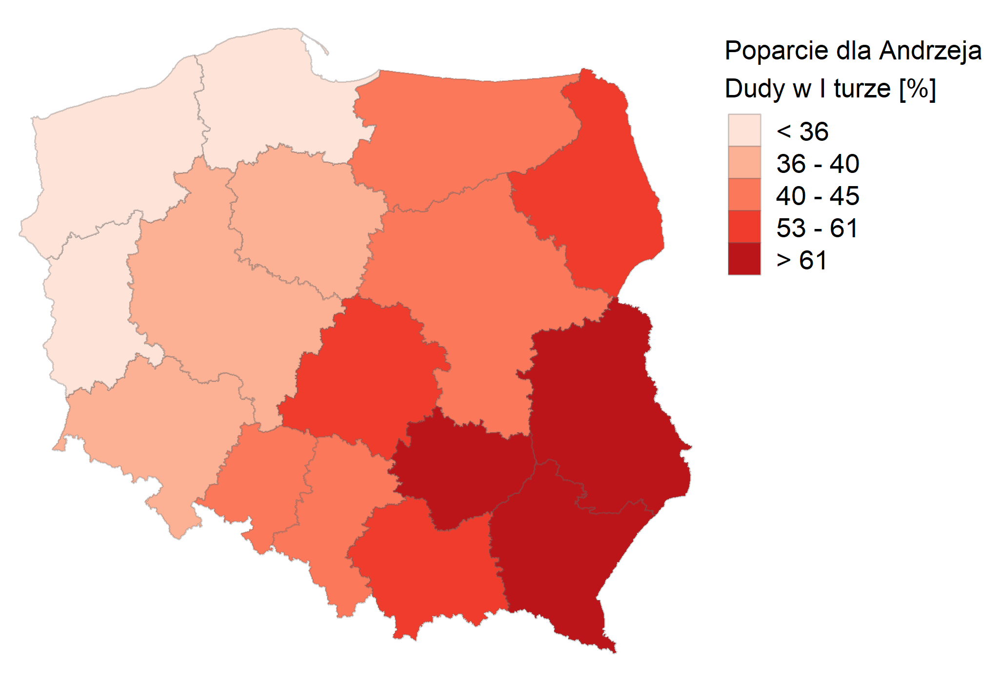
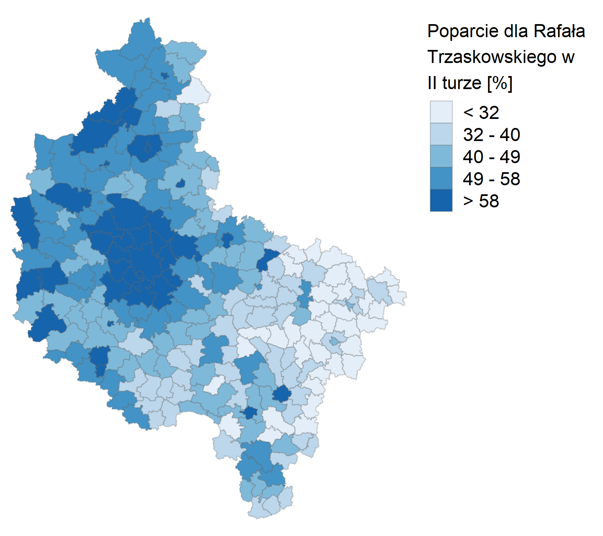
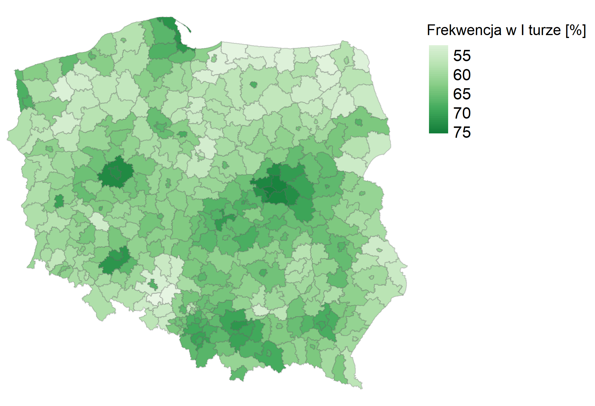
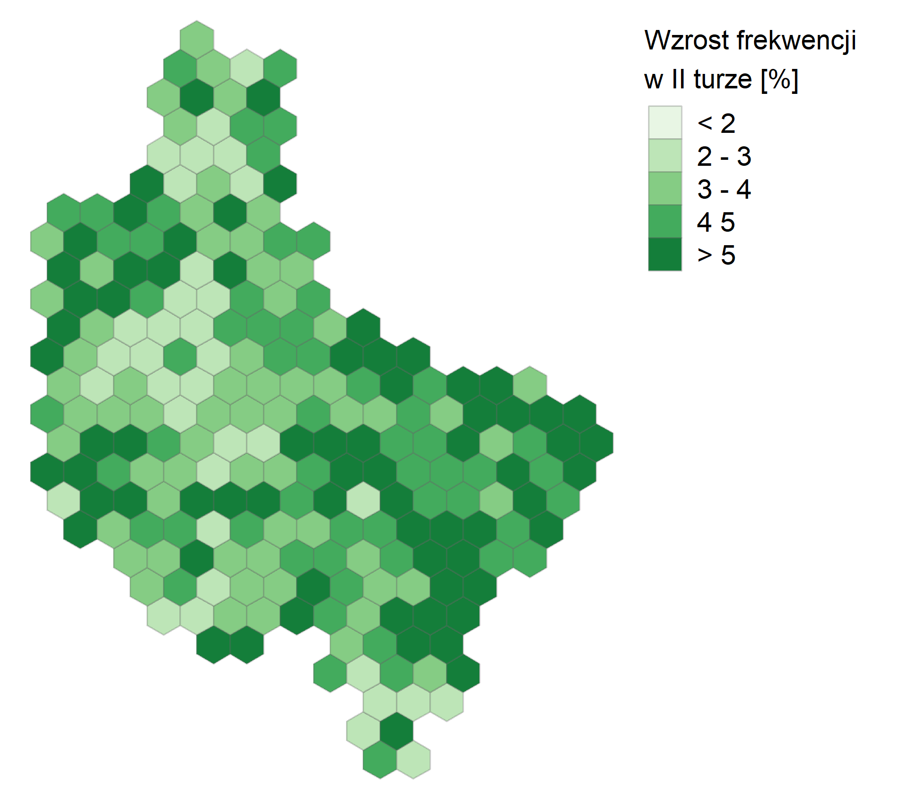
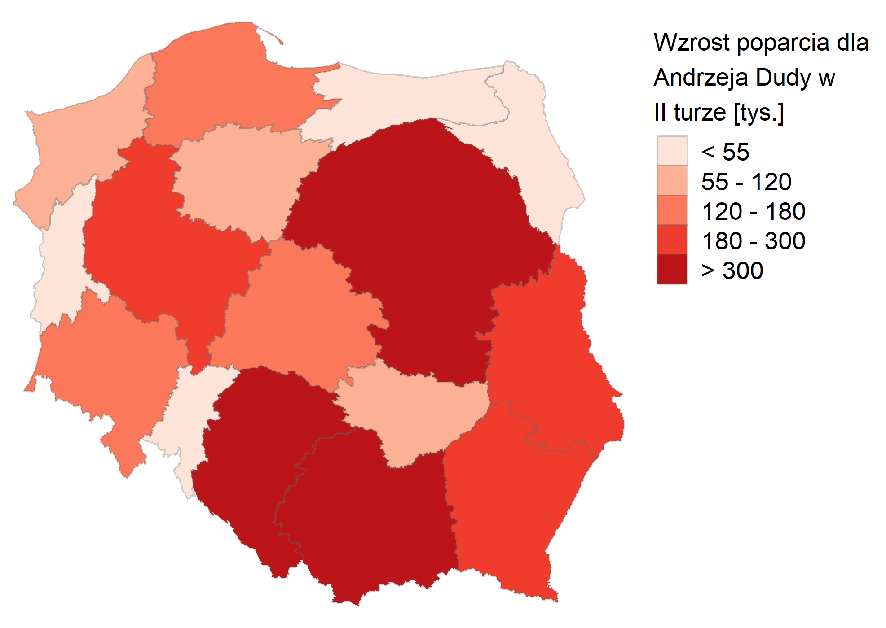
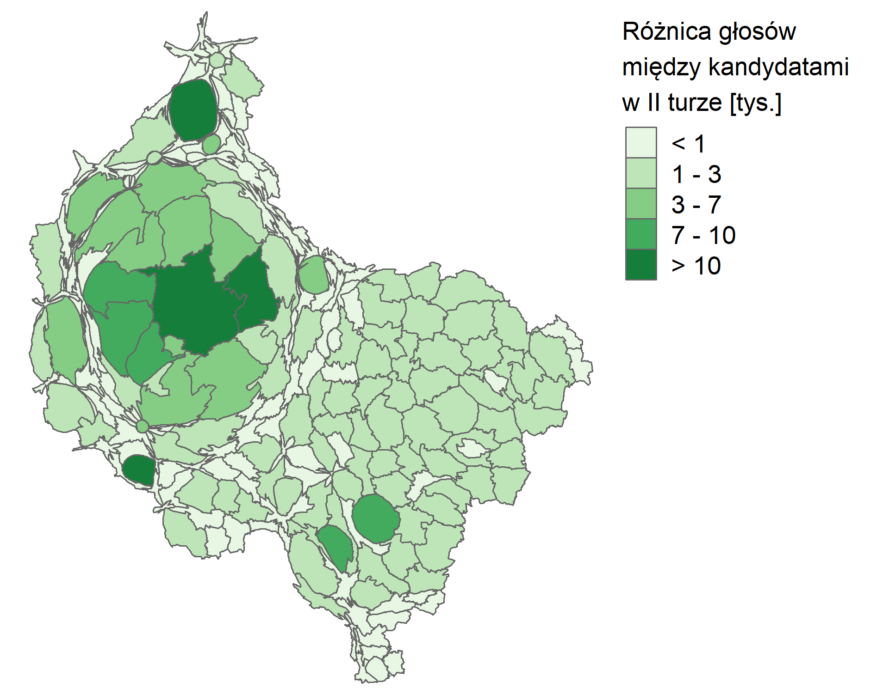
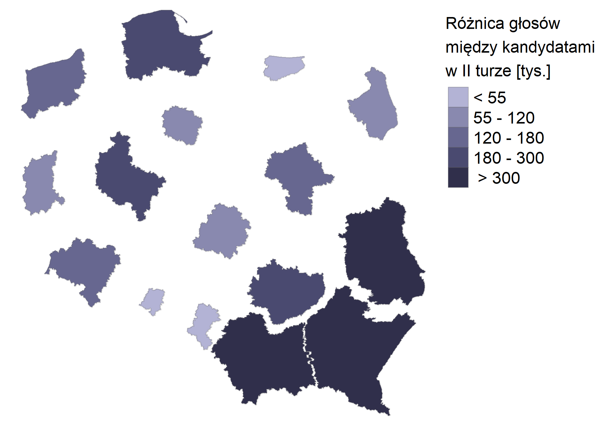
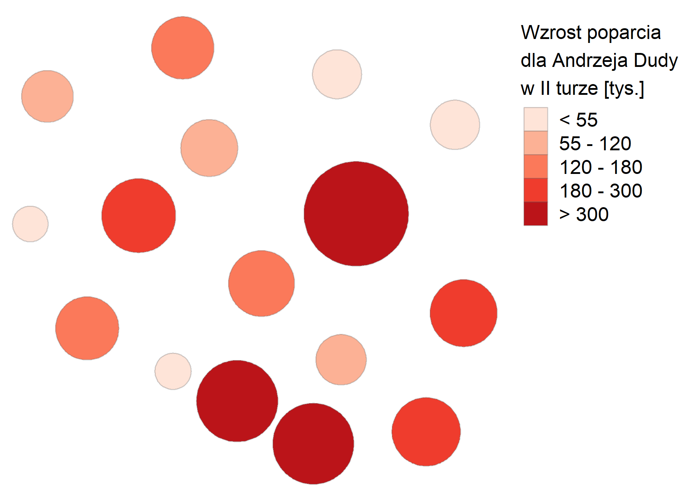
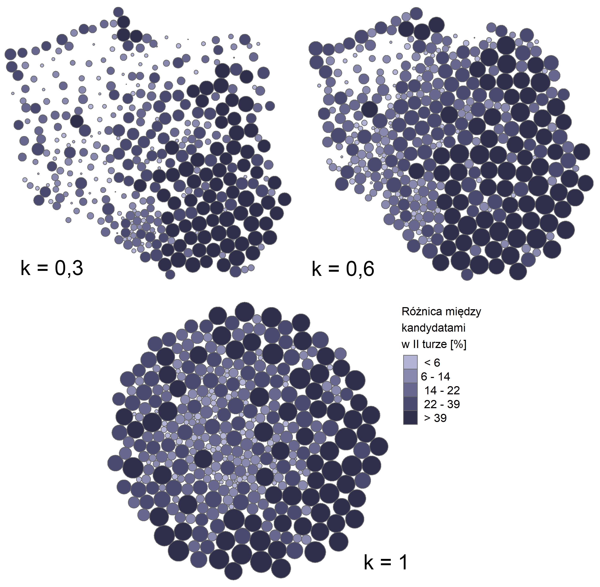

# Wizualizacje {#wizualizacje}

W tym rozdziale przedstawione zostały przykładowe mapy wyborcze używając technik wizualizacji, które można stworzyć za pomocą bibliotek *geogrid* oraz *cartogram.*

## Kartogram właściwy {#kartogramwlasciwy}

Kartogramy właściwe jest najpopularniejszą techniką wizualizacji w Polsce. 
Jest ona prosta w wykonaniu, a odbiorca jest w stanie bez problemu przeanalizować informacje na niej zawarte. 
W Atlasie Rzeczypospolitej Polskiej kartogram zastosowano dla prawie 80% map, a w Narodowym Atlasie Polski jest to 64% map [@debowska2010].
W Polsce najczęściej stosowanych jest pięć przedziałów klasowych, jednak w zależności od liczby jednostek odniesienia można je modyfikować (Ryc. \@ref(fig:ryc41)-\@ref(fig:ryc42)).

```{r ryc41, echo=FALSE, fig.cap="Przykład kartogramu właściwego na poziomie województw - poparcie dla Andrzeja Dudy w I turze wyborów. Źródło: opracowanie własne na podstawie danych PKW", out.width=300}

```

```{r ryc42, echo=FALSE, fig.cap="Przykład kartogramu właściwego na poziomie gmin w województwie wielkopolskim - poparcie dla Rafała Trzaskowskiego w II turze wyborów. Źródło: opracowanie własne na podstawie danych PKW", out.width=300}

```

## Kartogramy ciągłe {#kartogramyciagle}

Kartogramy ciągłe są rzadziej stosowane w wizualizowaniu zjawisk społeczno-ekonomicznych. 
Ze względu na ograniczenia percepcyjne kartogramy ciągłe są stosowane głównie, kiedy mamy na celu oszacowanie wartości jednostek, a nie odczytywanie konkretnych wartości (Ryc. \@ref(fig:ryc43)). 

```{r ryc43, echo=FALSE, fig.cap="Przykład kartogramu ciągłego na poziomie powiatów - frekwencja w I turze wyborów. Źródło: opracowanie własne na podstawie danych PKW", out.width=300}
knitr::include_graphics("figures/ryc43.png")
```

## Kartogramy geometryczne {#kartogramygeometryczne}

W polskiej literaturze kartogramy geometryczne są najczęściej tworzone poprzez podzielenie całego badanego obszaru na pola o równym kształcie i wielkości [@ratajski1989]. 
W pracy została użyta zmodyfikowana metoda, w której jednostki odniesienia zostały zmienione na jednakowe pola (heksagonalne lub kwadratowe). 
Pozwala to na łatwiejsze porównywanie wartości różnych obszarów (Ryc. \@ref(fig:ryc44)). 
Tak jak w przypadku kartogramu ciągłego, taki rodzaj wizualizacji jest szczególnie przydatny do szacowania wartości jednostek. 
Wadą tej techniki jest ograniczona możliwość identyfikacji prawdziwych jednostek odniesienia, można to szczególnie na Ryc. \@ref(fig:ryc45), gdzie pomimo małej liczby pól, trudno jest rozpoznać np. województwo wielkopolskie. 

```{r ryc44, echo=FALSE, fig.cap="Przykład kartogramu geometrycznego na poziomie województw - poparcie dla Rafała Trzaskowskiego w II turze wyborów. Źródło: opracowanie własne na podstawie danych PKW", out.width=300}

```

```{r ryc45, echo=FALSE, fig.cap="Przykład kartogramu geometrycznego na poziomie gmin w województwie wielkopolskim - wzrost frekwencji w II turze wyborów. Źródło: opracowanie własne na podstawie danych PKW", out.width=300}

```

## Anamorfoza ciągła {#anamorfozaciagla}

Poniższa technika wizualizacji jest przedmiotem badań kartografów w Polsce, jednak nie zyskała ona popularności poza tym kręgiem [@michalski2008; @krzywickablum2009; @markowska2018; @markowska2019; @lamparski2018]. 
Zaletą tej techniki jest wykorzystanie jednostek administracyjnych, co ułatwia odbiorcy lokalizację oraz rozpoznanie ich. 
Przykład województw jest przystępny do odbioru dla użytkownika nawet, kiedy różnice między jednostkami są duże (Ryc. \@ref(fig:ryc46)). 
Sprawy inaczej się mają w przypadku zastosowania powiatów lub gmin - duża liczba jednostek oraz skrajne wartości powodują znaczną deformację mapy, co zostało zaprezentowane na Ryc. \@ref(fig:ryc47). 
Podsumowując, taka forma wizualizacji jest użyteczna, kiedy prezentowana jest ograniczona liczba jednostek.

```{r ryc46, echo=FALSE, fig.cap="Przykład anamorfozy ciągłej na poziomie województw - wzrost poparcia dla Andrzeja Dudy w II turze wyborów. Źródło: opracowanie własne na podstawie danych PKW", out.width=300}

```

```{r ryc47, echo=FALSE, fig.cap="Przykład anamorfozy ciągłej na poziomie gmin w województwie wielkopolskim - różnica głosów między kandydatami w II turze wyborów. Źródło: opracowanie własne na podstawie danych PKW", out.width=300}

```

## Anamorfoza nieciągła {#anamorfozanieciagla}

Podobne zastosowanie do anamorfoz ciągłych mają anamorfozy nieciągłe. 
Mała liczba jednostek oraz różnice między wartościami sprawiają, że mapa jest czytelna dla odbiorcy. 
Zaletą tej techniki jest zachowanie oryginalnej geometrii i lokalizacji, co ułatwia użytkownikowi zlokalizowanie jednostek, np. województw (Ryc. \@ref(fig:ryc48)). 
Zmiana powierzchni jednostek wiąże się jednak z przerwaniem topologii między jednostkami - jest to szczególnie uciążliwe, kiedy mamy jednostkę wewnątrz drugiej i utrudnia odczytanie informacji, np. miasta wewnątrz gmin miejsko-wiejskich (Ryc. \@ref(fig:ryc49)). 
W tym przypadku autor nie zaleca stosowania tej techniki. 
Ważne w tej technice jest również dopasowanie argumentów funkcji tak, aby jednostki na siebie nie nachodziły. 
Możliwości dopasowania zostały omówione w rozdziale \@ref(biblioteki).

```{r ryc48, echo=FALSE, fig.cap="Przykład anamorfozy nieciągłej na poziomie województw - różnica głosów między kandydatami w II turze wyborów. Źródło: opracowanie własne na podstawie danych PKW", out.width=300}

```

```{r ryc49, echo=FALSE, fig.cap="Przykład anamorfozy nieciągłej na poziomie gmin w województwie wielkopolskim - frekwencja w II turze wyborów. Źródło: opracowanie własne na podstawie danych PKW", out.width=300}
knitr::include_graphics("figures/ryc49.png")
```

## Kartodiagram Dorlinga {#kartodiagramdorlinga}

Kartodiagram Dorlinga wykorzystuje koła jako pola podstawowe, a ich powierzchnia jest zależna od reprezentowanej wartości. 
Atutem tej techniki jest możliwość wyróżnienia obszarów o dużej intensywności zjawiska. 
Tak jak w przypadku dwóch powyższych technik, zalecane jest użycie danych, który mają szeroki zakres wartości. 
Przykładem na to jest Ryc. \@ref(fig:ryc410) - wygenerowana wizualizacja wyraźnie reprezentuje wysokie wartości. 
Na poziomie gmin jednego województwa różnice są również widoczne, nawet przy użyciu wąskiego zakresu wartości (Ryc. \@ref(fig:ryc411)). 
W przypadku powiatów dla całego kraju jednak można napotkać się na problem z natłokiem oraz rozmieszczeniem kół, co wpływa na ocenę wizualną użytkownika. Tak jak wspomniano w rozdziale \@ref(biblioteki), poprzez manipulację argumentami możemy m.in. określić udział obwiedni jednostki wypełnionej większym okręgiem (Ryc. \@ref(fig:ryc412)). Przekłada się to na częściowe zachowanie kształtu wizualizacji i ułatwienie odbioru informacji z mapy.

```{r ryc410, echo=FALSE, fig.cap="Przykład kartodiagramu Dorlinga na poziomie województw - wzrost poparcia dla Andrzeja Dudy w II turze wyborów. Źródło: opracowanie własne na podstawie danych PKW", out.width=300}

```

```{r ryc411, echo=FALSE, fig.cap="Przykład kartodiagramu Dorlinga na poziomie gmin w województwie wielkopolskim - poparcie dla Rafała Trzaskowskiego w II turze wyborów. Źródło: opracowanie własne na podstawie danych PKW", out.width=300}
knitr::include_graphics("figures/ryc411.png")
```

```{r ryc412, echo=FALSE, fig.cap="Przykłady kartodiagramu Dorlinga na poziomie powiatów z trzema wariantami argumentu k - różnica głosów między kandydatami w II turze wyborów.Źródło: opracowanie własne na podstawie danych PKW", out.width=400}

```
