# Ankieta {#ankieta}

## Ankiety dotyczące map wyborczych {#ankietyintro}

W ramach pracy zostały przeprowadzone dwie ankiety w celu zbadania czytelności wybranych technik wizualizacji. 
Każda z ankiet zawierała siedem pytań z dołączonymi do nich wizualizacjami. 
Pytania były takie same dla obu grup, różniły je jednak użyte wizualizacje. 
Podział na grupy miał na celu określenie, która z technik pozwala na lepszą ocenę zjawiska. 
Do każdego pytania znano prawidłową odpowiedź. 
Osoby wypełniające ankietę były studentami drugiego, trzeciego i czwartego roku studiów na Wydziale Nauk Geograficznych i Geologicznych UAM, można więc przyjąć, że ich wiedza kartograficzna i geograficzna była na podobnym poziomie. 
Na każdą z ankiet poprzez platformę Google Forms odpowiedziały 34 osoby. 
Skale barw dla map zostały wybrane w taki sposób, aby każdy przedział był dobrze rozróżnialny i nie sugerował partii politycznej (tj. czerwony i niebieski). 
W anamorfozie ciągłej oraz nieciągłej zastosowano tylko jeden kolor - celem tego było sprawdzenie w jakim stopniu zmiana w kształcie jednostek ma wpływ na percepcję oraz czytelność mapy. 
Przy wyborze skali barw pod uwagę wzięto również osoby z daltonizmem, aby zmniejszyć szansę przypadkowego wybierania odpowiedzi.

### Pytanie pierwsze {#pyt1}

**Pytanie: Jaki odsetek powiatów miało frekwencję powyżej 60%?**
```{r ryc51, echo=FALSE, fig.cap="Anamorfoza ciągla oraz kartogram ciągły - frekwencja w II turze wyborów. Źródło: opracowanie własne na podstawie danych PKW", out.width=400}
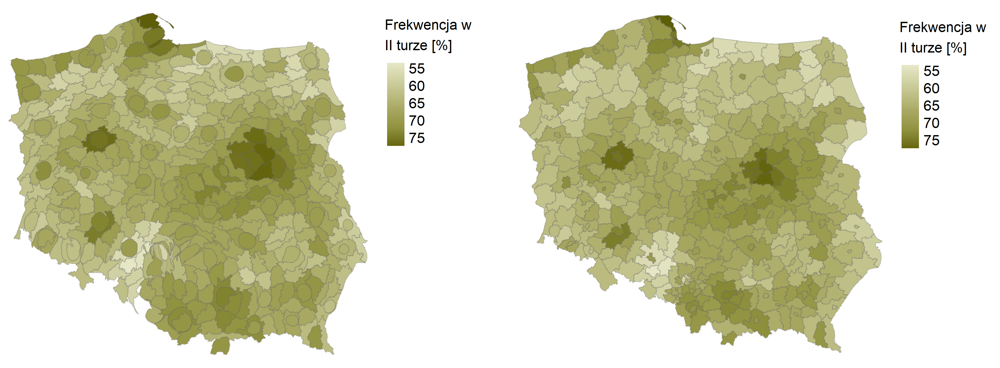
```
**Poprawna odpowiedź: 66%**

W pierwszym pytaniu osoby miały za zadanie odpowiedzieć na pytanie dot. odsetka powiatów z frekwencją powyżej 60% (Ryc. \@ref(fig:ryc51)).
W grupie pierwszej w celu wizualizacji została używa anamorfoza ciągła, a w drugiej kartogram ciągły. 
Wyniki w grupach były podobne - w każdej z grup dwie osoby uważały, że *mniej niż 20%* powiatów miało wysoką frekwencję. 
Niewiele więcej osób wybrało odpowiedź, iż wynik oscyluje *między 20 a 40%* - były to cztery osoby w pierwszej grupie, w drugiej sześć osób (Ryc. \@ref(fig:ryc52)). 
W pierwszej grupie najwięcej osób (14 os.) wybrało wariant *40-60%*, w drugiej grupie było to 11 osób. 
Poprawną odpowiedź, czyli *60-80%* wybrało po 12 osób w każdej z grup. 
Tylko dwie osoby z grupy pierwszej, a trzy z drugiej uważały, że odsetek jest *wyższy niż 80%*. 

```{r ryc52, echo=FALSE, fig.cap="Wykres z wynikami do pytania pierwszego (obie grupy). Źródło: opracowanie własne na podstawie danych PKW", out.width=300}
knitr::include_graphics("figures/ryc52.png")
```

### Pytanie drugie {#pyt2}

**Pytanie: W jakim % gmin kandydat B wygrał w II turze?**
```{r ryc53, echo=FALSE, fig.cap="Kartodiagram Dorlinga oraz kartogram geometryczny - poparcie dla kandydata B w II turze. Źródło: opracowanie własne na podstawie danych PKW", out.width=400}
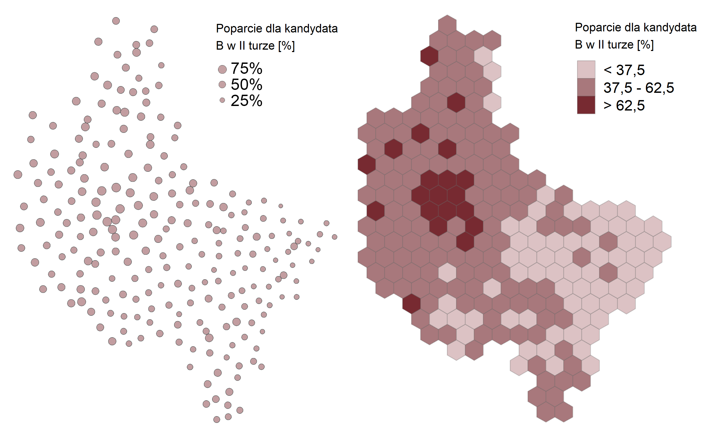
```
**Poprawna odpowiedź: 36,3%**

Kartodiagram Dorlinga oraz kartogram geometryczny (heksagonalny) wykorzystano w pytaniu drugim (Ryc. \@ref(fig:ryc53)). 
Mapy różnią się od siebie wartościami przedziałów, mimo tego w pytaniu drugim osiem osób w obu grupach wybrało prawidłową odpowiedź. 
W grupie pierwszej tylko cztery osoby wybrało pierwszą odpowiedź - dwa razy więcej osób wybrało tą opcję w grupie drugiej. 
Na podstawie rycin w grupie drugiej dziewięć osób uważało, że kandydat B zdobył *pomiędzy 20 a 30%* głosów, w pierwszej grupie było to 11 osób (Ryc. \@ref(fig:ryc54)). 
Czwarty wariant, czyli *40-50%*, wybrało pięć osób w pierwszej i osiem osób w drugiej grupie. 
Sześć osób z pierwszej oraz jedna osoba z drugiej grupy wywnioskowała, że kandydat B wygrał *ponad 50%* gmin w II turze wyborów.

```{r ryc54, echo=FALSE, fig.cap="Wykres z wynikami do pytania drugiego (obie grupy). Źródło: opracowanie własne na podstawie danych PKW", out.width=300}
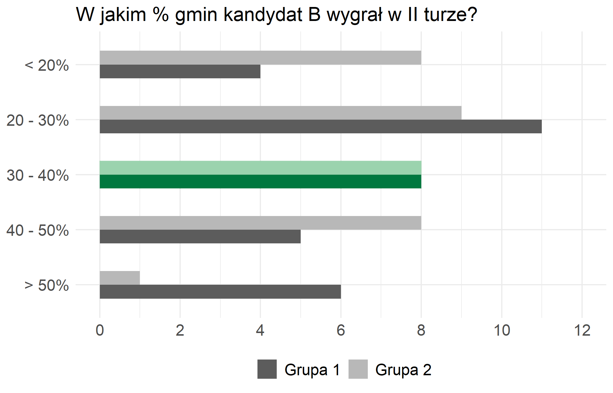
```

### Pytanie trzecie {#pyt3}

**Pytanie: W ilu % gmin zaobserwowano wzrost frekwencji w II turze o co najmniej 5%?**
```{r ryc55, echo=FALSE, fig.cap="Kartogram właściwy oraz kartogram geometryczny - wzrost frekwencji w II turze. Źródło: opracowanie własne na podstawie danych PKW", out.width=400}
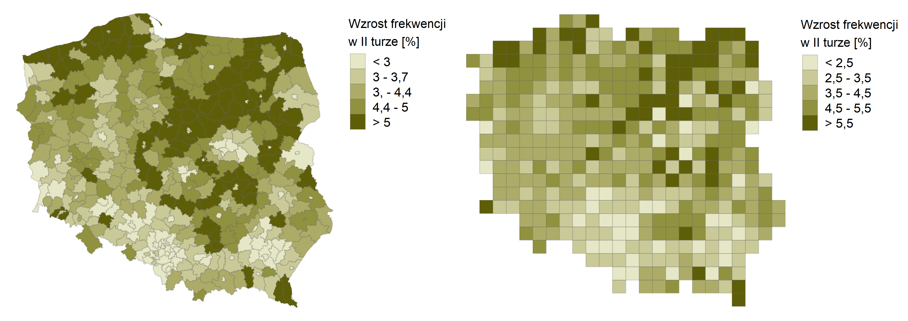
```
**Poprawna odpowiedź: 21,6%**

Trzecie pytanie dotyczyło wzrostu frekwencji II turze (Ryc. \@ref(fig:ryc55)).
W grupie pierwszej ankietowani najczęściej uważali, że wzrost frekwencji dotyczył więcej niż 20% powiatów w Polsce (15 os.). 
Niewiele mniej, czyli 14 osób wybrało odpowiedź *15-20%*. Wariant trzeci, czyli *10-15%* wybrało osiem osób, a *5-10%* - 11 osób ankietowanych (Ryc. \@ref(fig:ryc56)).
Nikt w grupie pierwszej nie sądził, że wzrost frekwencji zaobserwowano w *mniej niż 5%* gmin.

W grupie drugiej tą samą opcję wybrała tylko jedna osoba, a sześć osób wybrało przedział *5-10%*. 
Wariant *10-15%* wybrało najwięcej ankietowanych, czyli 12 osób. 
11 osób zinterpretowało na mapie, że znaczny wzrost frekwencji zaobserwowano w *15-20%* gmin. 
Tylko cztery osoby najwyższą opcję, czyli *> 20%*.

```{r ryc56, echo=FALSE, fig.cap="Wykres z wynikami do pytania trzeciego (obie grupy). Źródło: opracowanie własne na podstawie danych PKW", out.width=300}
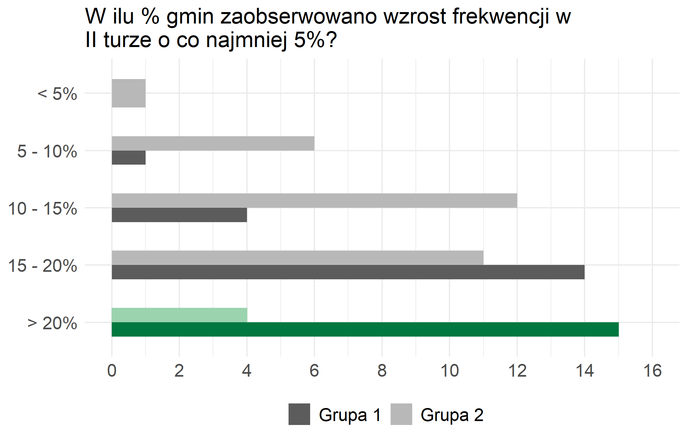
```

### Pytanie czwarte {#pyt4}

**Wymień 3 województwa z najwyższą frekwencją**
```{r ryc57, echo=FALSE, fig.cap="Kartogram geometryczny oraz anamorfoza nieciągła - frekwencja w II turze. Źródło: opracowanie własne na podstawie danych PKW", out.width=400}
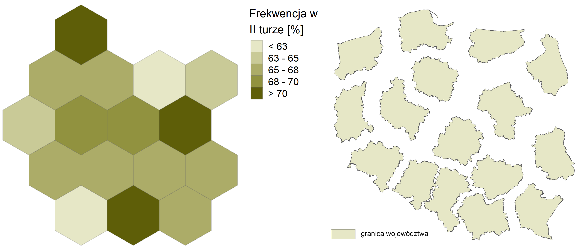
```
**Poprawna odpowiedź: woj. mazowieckie, woj. małopolskie, woj. pomorskie**

W pytaniu 4 ankietowani mieli za zadanie wymienić trzy województwa z najwyższą frekwencją (Ryc. \@ref(fig:ryc57)). 
W pierwszej grupie do wizualizacji został użyty kartogram geometryczny (heksagonalny), a w drugiej - anamorfoza nieciągła. 
Było to jedno z najtrudniejszych pytań dla ankietowanych, bowiem tylko 20,6% (siedem osób) w pierwszej grupie udało się na nie odpowiedzieć prawidłowo.
Najwięcej osób wybierało województwo mazowieckie oraz wielkopolskie jako te, które mają najwyższą frekwencję. 
W grupie drugiej nikomu nie udało się poprawnie odpowiedzieć na to pytanie - tylko siedem osób wybrało województwo małopolskie, a dziesięć osób województwo pomorskie (Ryc. \@ref(fig:ryc58)). 
Najczęstszą odpowiedzią drugiej grupy było *woj. mazowieckie, woj. pomorskie, woj. wielkopolskie*. 
W pierwszej grupie poza prawidłową odpowiedzią, popularna była również odpowiedź *woj. mazowieckie, woj. pomorskie, woj. śląskie* (sześć osób) oraz *woj. małopolskie, woj. mazowieckie, woj. zachodniopomorskie* (pięć osób).

```{r ryc58, echo=FALSE, fig.cap="Wykres z wynikami do pytania czwatego (obie grupy). Źródło: opracowanie własne na podstawie danych PKW", out.width=300}
knitr::include_graphics("figures/ryc58.png")
```

### Pytanie piąte {#pyt5}

**Pytanie: Jaki ogólnie % głosów kandydat A uzyskał w woj. wielkopolskim?**
```{r ryc59, echo=FALSE, fig.cap="Anamorfoza ciągła oraz kartogram właściwy - poparcie dla kandydata A w I turze. Źródło: opracowanie własne na podstawie danych PKW", out.width=400}
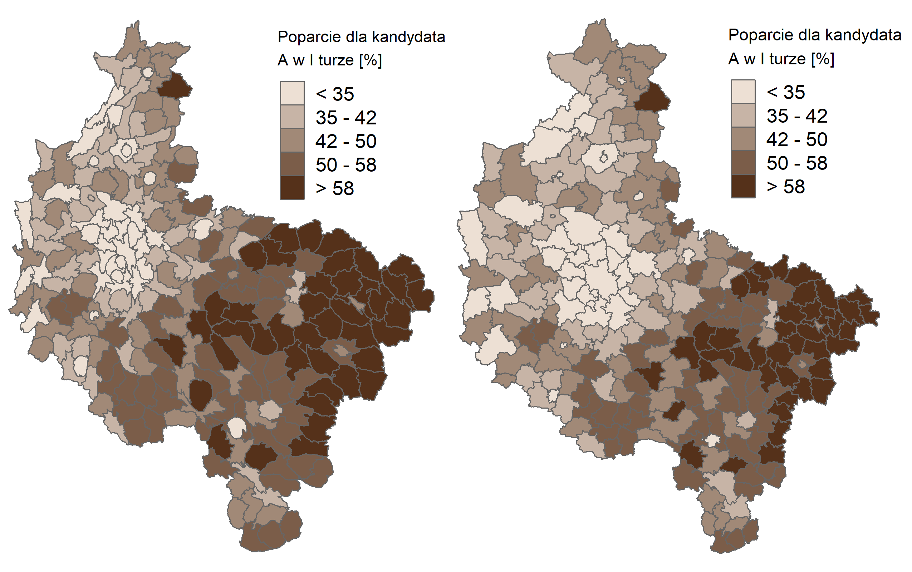
```
**Poprawna odpowiedź: 37,8%**

W pytaniu 5 ankietowani mieli za zadanie oszacować odsetek głosów, które kandydat A uzyskał w województwie wielkopolskim (Ryc. \@ref(fig:ryc59)). 
W grupie pierwszej zastosowano anamorfozę ciągłą, a w grupie drugiej kartogram właściwy. 
Żadna z grup nie uważała, że poparcie było *mniejsze niż 35%*. Osiem osób uważało, że wynik wynosił *między 35 a 42%* - były to dwie osoby w grupie pierwszej oraz sześć w grupie drugiej (Ryc. \@ref(fig:ryc510)). 
Poprawną odpowiedź, czyli 37,8%, znajdowała się w zakresie, który wybrała połowa pierwszej grupy (17 osób) oraz dziewięć osób w grupie drugiej. 
W przedziale *40-50%* było za to odwrotnie - połowa grupy drugiej wybrała ten przedział, a z grupy pierwszej - 13 osób. 
Dwie osoby z każdej z grup uważało, że kandydat B uzyskał *ponad 50% głosów* w województwie wielkopolskim.

```{r ryc510, echo=FALSE, fig.cap="Wykres z wynikami do pytania piątego (obie grupy). Źródło: opracowanie własne na podstawie danych PKW", out.width=300}
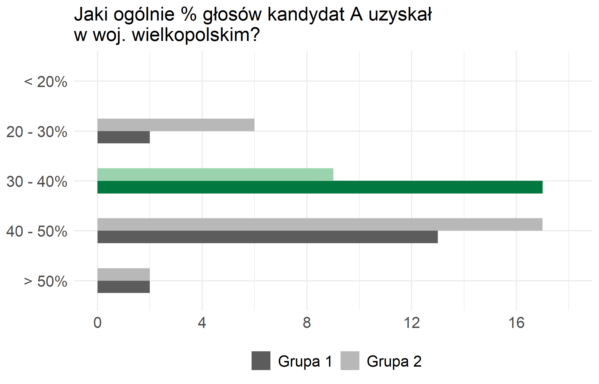
```

### Pytanie szóste {#pyt6}

**Pytanie: O ile średnio % wzrosło poparcie dla kandydata B w II turze w porównaniu do I tury?**
```{r ryc511, echo=FALSE, fig.cap="Kartogram geometryczny oraz anamorfoza ciągła - wzrost poparcia dla kandydata B w II turze. Źródło: opracowanie własne na podstawie danych PKW", out.width=400}
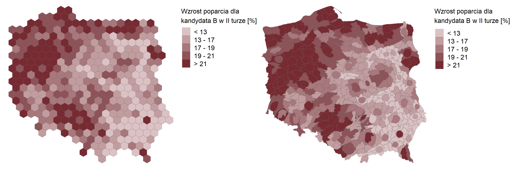
```
**Poprawna odpowiedź: 17,6%**

Na pytanie piąte udało się odpowiedzieć poprawnie obu grupom (Ryc. \@ref(fig:ryc511)). 
Ponad 50% grupy pierwszej (18 osób) oraz 12 osób z grupy drugiej poprawnie wywnioskowało, że poparcie kandydata B w II turze wzrosło o *mniej niż 20%* (Ryc. \@ref(fig:ryc512)). 
Dziewięć osób z każdej z grup wybrało odpowiedź, że poparcie wzrosło *między 20 a 40%*. 
Pięć osób z pierwszej grupy oraz dziesięć z drugiej grupy uważa, że odpowiedź *40-60%* była poprawna. 
Przedostatnią odpowiedź, wybrały dwie osoby z pierwszej oraz trzy osoby z drugiej grupy. 
Żadna z grup nie uważała, że poparcie wzrosło o *więcej niż 80%*.

```{r ryc512, echo=FALSE, fig.cap="Wykres z wynikami do pytania szóstego (obie grupy). Źródło: opracowanie własne na podstawie danych PKW", out.width=300}
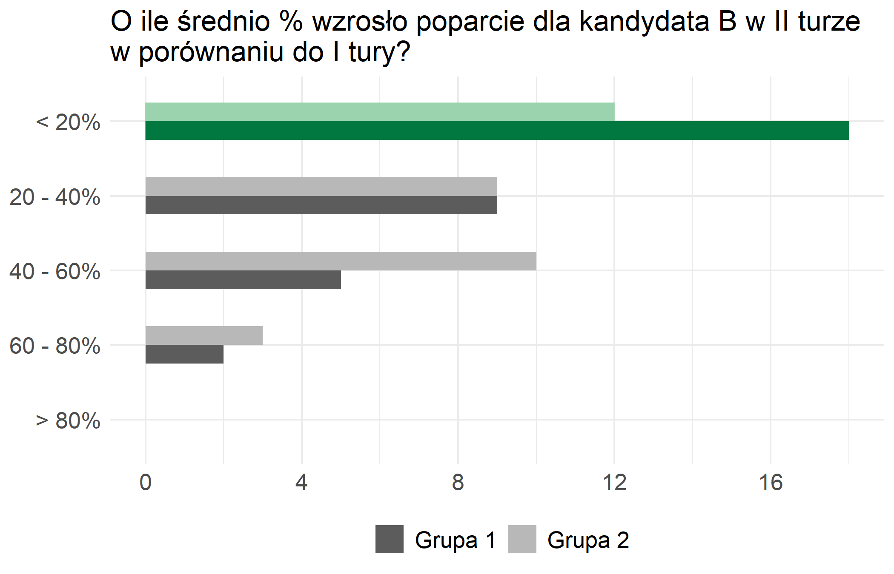
```

### Pytanie siódme {#pyt7}

**Pytanie: Mapa przedstawia różnicę głosów między kandydatami w II turze. W którym z województw była najmniejsza różnica wyników?**
```{r ryc513, echo=FALSE, fig.cap="Anamorfoza nieciągła oraz anamorfoza ciągła - róznica głosów między kandydatami w II turze. Źródło: opracowanie własne na podstawie danych PKW", out.width=400}
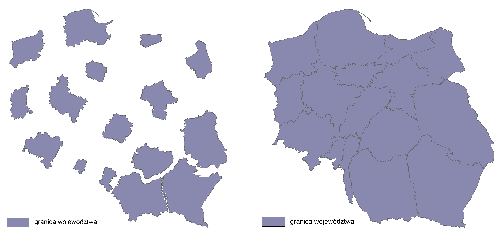
```
**Poprawna odpowiedź: woj. opolskie**

W ostatnim pytaniu zadaniem było wybranie województwa, w którym była najmniejsza różnica wyników w II turze (Ryc. \@ref(fig:ryc513)). 
W pierwszej grupie zastosowano anamorfozę nieciągłą, a w drugiej - anamorfozę ciągłą. 
W obu grupach największą liczbę głosów zdobyło *województwo opolskie* - zostałaona wybrana przez 11 osób z grupy pierwszej oraz dziewięć z grupy drugiej (Ryc. \@ref(fig:ryc514)). 
Drugim najczęściej wybieranym województwem było *województwo podkarpackie* - sześć osób w każdej z grup uważało, że ta odpowiedź jest poprawna. 
W grupie pierwszej *województwo mazowieckie* oraz *kujawsko-pomorskie* uzyskało po cztery głosy. 
Pięć osób z drugiej grupy wybrało *województwo zachodniopomorskie*, a następne pięć - *lubelskie*. 
Pozostałe województwa uzyskały od zera do trzech głosów.

```{r ryc514, echo=FALSE, fig.cap="Wykres z wynikami do pytania siódmego (obie grupy). Źródło: opracowanie własne na podstawie danych PKW", out.width=300}
knitr::include_graphics("figures/ryc514.png")
```

## Wnioski {#wnioski}

Wnioski uzyskane z ankiety sugerują, że forma, w jakiej informacja jest przedstawiana, ma znaczny wpływ na odbiór informacji o rozmieszczeniu oraz zależności zjawisk przez użytkownika. 
Dotyczy to zarówno metody wizualizacji oraz pól odniesienia. 
Należy jednak pamiętać, że poprawność odczytywania informacji z map zależy również od doświadczenia oraz umiejętności odbiorców w zakresie interpretacji map.

Pytania, w których użyte były kartogramy właściwe pokazują, że pomimo swoich wad, jest najbardziej przystępną formą wizualizacji dla ankietowanych. 
W pytaniu 3 ta wizualizacja była bardziej czytelna od kartogramu heksagonalnego - zdecydowana większość głosów była skupiona w zakresie poprawnej odpowiedzi. 
Odpowiedzi do pytania 5 były mniej trafne, jednak równie skupione między dwoma wariantami bliskimi poprawnej odpowiedzi (37,8%). 
W obu przypadkach poprawne odpowiedzi były blisko granicy swojego przedziału, co miało wpływ na rozkład wyników.

Kartogram ciągły został użyty raz, w Pytaniu 1, gdzie większość ankietowanych nie była w stanie odpowiedzieć poprawnie. 
Bazując na tym wyniku oraz zasadzie kartograficznej, która nie zaleca używania więcej niż siedem lub osiem podobnych odcieni [@ratajski1989], można wyciągnąć wniosek, że używanie wielu gradacji jednej barwy dla dużej liczby jednostek odniesienia znacznie utrudnia użytkownikowi odczytanie prawidłowych informacji. 
Ludzkie oko nie jest w stanie rozróżnić oraz zidentyfikować tak wielu odcieni jednej barwy na mapie. 
Prostym rozwiązaniem byłoby zastosowanie kartogram właściwego oraz przedziałów klasowych.

W pytaniu, gdzie użyto kartogramu heksagonalnego dla gmin województwa wielkopolskiego, nie uzyskano jednoznacznej odpowiedzi u ankietowanych - 98% głosów zostało podzielonych między trzy odpowiedzi, w zakresie od *< 20%* do *40-50%*. 
Może to sugerować kilka wniosków. 
Po pierwsze, że mapa nie jest wystarczająco czytelna dla odbiorców. 
Po drugie, że zastosowanie takich samych pól odniesienia utrudnia ankietującym oszacowanie wyniku. 

W przypadku wizualizacji użytej w pytaniu 6 u grupy pierwszej, można zauważyć, że ponad połowa osób ankietowanych odpowiedziała poprawnie na to pytanie i wybrała pierwszą odpowiedź. 
Im większa różnica od poprawnej odpowiedzi, tym mniej osób ją wybierało. 
Może to sugerować, że jednorodność jednostek odniesienia jest pomocna w oszacowaniu proporcji.

Jednakowe jednostki odniesienia są kartogramów geometrycznych również wadą, co można zaobserwować w pytaniu 4 w grupie pierwszej. 
W zadaniu, którego celem było wskazanie trzech województw z najwyższą frekwencją, tylko 20,6% ankietowanych było w stanie poprawnie zlokalizować województwa. 
Należy zauważyć, że tylko trzy jednostki odniesienia należą do przedziału z najwyższymi wartościami. 
Można więc wyciągnąć wniosek, że najtrudniejszą częścią tego zadania było wskazanie konkretnych województw, co zostało w znacznym stopniu utrudnione właśnie przez użycie takiej samej geometrycznej dla wszystkich jednostek. 
Wiedza o tym, które z województw jest bardziej na wschód lub które są bardziej wewnątrz Polski (bliżej środkowego punktu Polski) mogą pomóc w ich zlokalizowaniu, jednak nie jest to wiedza, po którą użytkownik sięga odruchowo.

Podsumowując, kartogramy geometryczne sprawdzają się, jeśli odbiorca nie musi rozróżniać każdej z jednostek (tak jak w przypadku pytania 4). 
Takie rozwiązanie może być alternatywą dla technik, które używają niejednorodnych pól odniesienia. 
Dodatkowo wyniki pytań, w których użyte były kartogramy heksagonalne oraz kartogram kwadratowy tak jak powyższych przykładach potwierdzają, że różnice w kolorze między klasami jest istotnym czynnikiem w odbiorze mapy.

Anamorfoza ciągła na przykładzie ostatniego pytania wypada gorzej od anamorfozy nieciągłej, jednak w obu przypadkach udało się w znacznej mierze odpowiedzieć poprawnie. 
Wyniki również sugerują, że część ankietowanych nie przeczytała dokładnie pytania, bowiem sześć osób z każdej grup wybrało województwo, w którym była największa różnica liczby głosów (zadanie miało na celu wskazanie województwa z najmniejszą różnicą głosów - przypomina autorka). 
Być może znaczne zniekształcenie niektórych z województw utrudniło ankietowanym określenie ich rozmiaru wobec sąsiadujących jednostek. 
W zadaniu 6 anamorfoza ciągła dała gorsze wyniki w porównaniu z kartogramem geometrycznym, bowiem nie udało się uzyskać jednoznaczne poprawnej odpowiedzi. 
Warianty *< 20%, 20-40%* i *40-60%* różniły się między sobą jednym lub dwoma głosami. 
Całkowicie inaczej było w pytaniu 5, gdzie znaczna część ankietowanych wybrała poprawny zakres, w mniejszym stopniu ankietowani wybrali sąsiadujący zakres (poprawna odpowiedź wynosiła 37,8%, a przedziały dzieliły się na zakresy *30-40%* oraz *40-50%*, przez co można podejrzewać, że ta mniejsza część ankietowanych nieznacznie przeszacowała wynik). 
Wyniki sugerują te same wnioski przy pytaniu 1.

Najtrudniejsza w interpretacji użytkowników była wizualizacja anamorfozy nieciągłej w pytaniu 5 w grupie drugiej. 
Żadna z osób ankietowanych nie była w stanie odpowiedzieć poprawnie. 
Mogło to być związane z niewystarczającą znajomością województw lub brakiem wiedzy o mechanizmie działania anamorfoz nieciągłych. 
Dodatkowym utrudnieniem dla osób ankietowanych było zastosowanie odsetku frekwencji zamiast np. liczby ważnych głosów. 
Różnica między najmniejszym a największym odsetkiem frekwencji wynosiła tylko 13,9%. 
Skutkiem tego były mało wyraźne różnice między jednostkami.

W pytaniu 7 w grupie pierwszej również została użyta anamorfoza nieciągła, zastosowane jednak zostały wartości bezwzględne, a różnice wartości między każdym polem odniesienia wynosiły dziesiątki tysięcy - pozwoliło to na wyraźne zaznaczenie województw. 
Pomimo tego, tylko 30,6% osób wybrało prawidłową odpowiedź, a 17,6% wybrało *województwo podkarpackie*, które było jednostką z największą różnicą głosów. 
Sugeruje to, że część ankietowanych mogło źle zrozumieć pytanie, tak jak w przypadku anamorfozy ciągłej.

Z zadania, w którym został użyty kartodiagram Dorlinga wynika, że 23% ankietowanych odpowiedziało poprawnie i wybrało odpowiedź *30-40%*. 
Nie była to jednak najczęściej wybierana odpowiedź (jest to *20-30%* wybrane przez 11 os.). 
W tym pytaniu wyniki nie wykazały wyraźnie jednej dominującej odpowiedzi, każda miała podobną liczbę głosów. 
Opierając się o wyniki z pytania 2, kartodiagram Dorlinga okazuje się być nieadekwatny dla wizualizacji, w których zjawisko ma mały zakres wartości (np. odsetek frekwencji. Duże różnice między jednostkami umożliwiają nam na wyraźne zaznaczenie). 
Duża liczba pól podstawowych również utrudnia osobom zebranie i oszacowanie informacji z mapy. 
W przypadku, gdy mamy zmniejszą liczbę jednostek odniesienia oraz dane są przedstawiane w wartościach bezwzględnych, można łatwiej przekazać użytkownikowi informacje.

Biorąc pod uwagę wyniki ogółem, autorka śmie stwierdzić, że znaczna część ankietowanych w obu grupach nie potrafi odróżnić niektórych województw, np. pomorskiego i zachodniopomorskiego (Pytanie 4).
